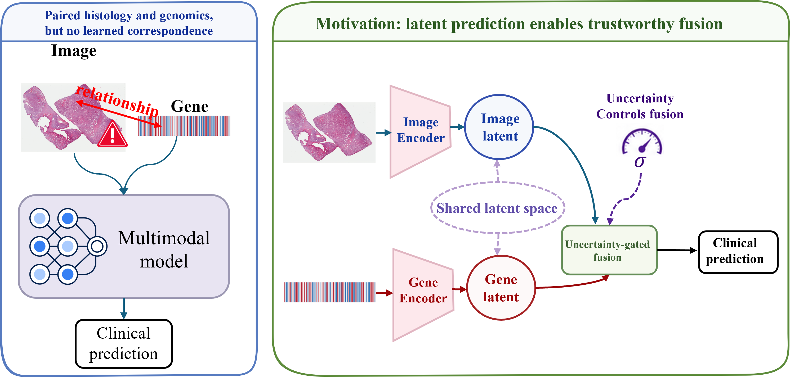
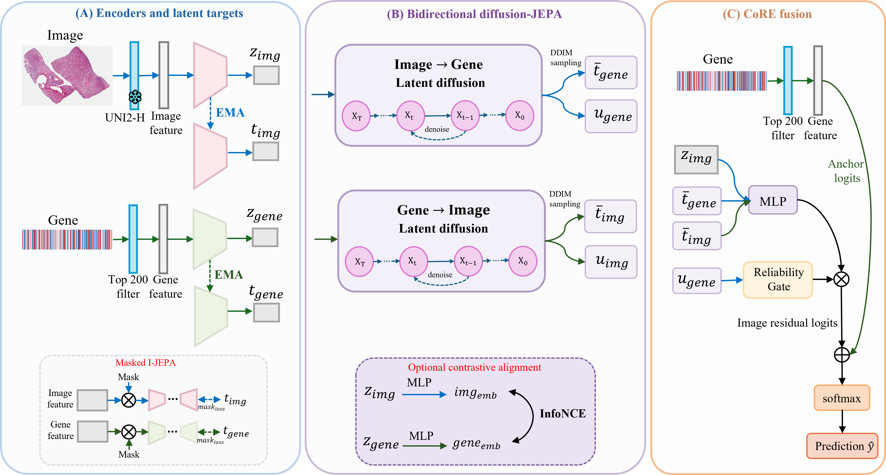
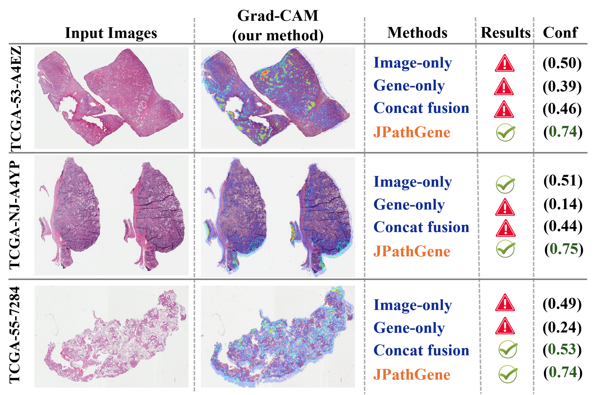

# JPathGene

**Cross-Modal Latent Diffusion Predictive Learning between Histopathology Images and Genetic Profiles**

*MICCAI 2026 — MULTITAB Workshop (Multimodal Learning with Medical Tabular Data)*

JPathGene formulates histopathology–genomics fusion as **JEPA-style bidirectional latent
prediction** rather than feature concatenation. Because one tissue phenotype maps to
*many* genetic programs, a deterministic predictor collapses this distribution to its
mean; instead a **conditional latent-diffusion predictor** (FiLM-conditioned, DDIM
sampling) models the full conditional distribution `p(gene latent | histology latent)`
— and symmetrically — in latent space. Its denoising loss *is* the JEPA objective
generalized to a distribution (deterministic JEPA = single-step limit). Sampling yields a
**per-patient cross-modal uncertainty**, and **CoRE-Fusion** uses that uncertainty to
gate an image expert that corrects a genomic anchor. We never reconstruct raw expression.

<p align="center">
  
</p>

## Method

<p align="center">
  
</p>

- **Modality encoders** map histology and gene features into a shared latent space, each
  with an EMA teacher for stable JEPA targets.
- **A single conditional predictor** solves both the within-modality masked I-JEPA task
  and the cross-modal task. As a conditional latent-diffusion model it captures the
  one-to-many mapping between morphology and molecular state; deterministic JEPA is the
  single-step special case.
- **Cross-modal uncertainty** is estimated from repeated diffusion samples per patient.
- **CoRE-Fusion** gates an image expert that corrects a genomic anchor, driven by
  cross-modal reliability.

Set `model.predictor.type: mlp` for the deterministic-JEPA ablation, or `diffusion`
(default) for the full model; `model.fusion.mode: uncertainty_gated` enables the gate.

## Repository layout

```
configs/        cohort + model YAML configs (tcga_brca_uni.yaml, tcga_luad_uni.yaml, ...)
datasets/       image_gene_feature_dataset.py, tcga_feature_dataset.py, transforms.py
models/         image_encoder, gene_encoder, target_encoders, jepa_predictors,
                diffusion_predictor, contrastive, fusion_blocks, pathgene_jepa,
                baselines, losses
utils/          metrics, survival_metrics, gene_utils, pca_utils, engine, io, logger, seed
scripts/        data prep + figure/table generators, WSI patch utilities
run_jepa_pretrain.py  run_downstream.py  run_crossval_compare.py  run_qualitative.py
run_ablation.py  run_alignment_analysis.py  run_gene_prediction_analysis.py
train.py  evaluate.py  extract_features.py  measure_efficiency.py
paper/          camera-ready LaTeX source (Springer LNCS)
assets/         figures used in this README
```

## Installation

```bash
pip install -r requirements.txt
```

## Data

JPathGene operates on **pre-extracted feature-level CSVs** (image features + gene
features joined by `patient_id`). Each cohort lives under `data/<COHORT>/`; see
[data/README.md](data/README.md) for the exact layout and column schema. Point each
config's `data.root` at your cohort directory.

Paired TCGA cohorts, slide-mean-pooled **UNI2-h** features (1536-d) and the 200
highest-variance RNA-seq genes, evaluated under **leakage-safe 5-fold × 5-seed CV**.

| Cohort | Endpoint | Patients | Image dim | Gene dim | Pos. rate |
|---|---|---:|---:|---:|---:|
| TCGA-BRCA | ER status | 113 | 1536 | 200 | 21% |
| TCGA-LUAD | TP53 mutation | 460 | 1536 | 200 | 48% |
| TCGA-LUAD | Stage I vs II+ | 393 | 1536 | 200 | 44% |

## Quickstart

```bash
# 0. sanity-check the feature dataset
python scripts/check_feature_dataset.py --config configs/feature_csv.yaml

# 1. JEPA pretraining
python run_jepa_pretrain.py --config configs/tcga_brca_uni.yaml

# 2. downstream head + evaluation
python run_downstream.py --config configs/tcga_brca_uni.yaml
python evaluate.py --config configs/tcga_brca_uni.yaml --checkpoint <path/to/best.pth>

# leakage-safe cross-validated comparison of all methods (main paper result)
python run_crossval_compare.py --config configs/tcga_brca_uni.yaml
```

## Models & baselines

`image_only`, `gene_only`, `early_fusion`, `late_fusion`, `concat_fusion`,
`gated_fusion`, `contrastive`, and `pathgene_jepa` — all share encoders for a fair
comparison. Optional: cross-attention fusion, TabTransformer gene encoder, pathway gene
targets.

## Reproducing the paper

Each result maps to one config + one entry point. LaTeX tables/figures are rendered from
the produced output CSVs — **numbers are never hand-edited**; missing results render as
clearly-labelled `TODO` templates.

| Paper item | Config | Command |
|---|---|---|
| BRCA comparison (UNI2-h) | `configs/tcga_brca_uni.yaml` | `python run_crossval_compare.py --config …` |
| Feature-quality (ResNet-50) | `configs/tcga_brca.yaml` | `python run_crossval_compare.py --config …` |
| 2⁴ factorial ablation | `configs/tcga_brca_uni.yaml` | `python run_crossval_compare.py --config … --factorial` |
| Proper scoring rules (Brier/NLL) | `configs/tcga_brca_uni.yaml` | `python run_qualitative.py --config …` |
| LUAD TP53 + stage | `configs/tcga_luad_uni.yaml`, `configs/tcga_luad_stage.yaml` | `python run_crossval_compare.py --config …` |
| Qualitative cases (LUAD-stage) | `configs/tcga_luad_stage.yaml` | `python run_qualitative.py --config …` |

## Results

### TCGA-BRCA (UNI2-h features, mean ± std)

JPathGene reaches the **highest multimodal AUC**, matching the strong gene-only baseline
while being **substantially better calibrated** (ECE 0.094 vs 0.229, *p* < 0.001).

| Method | AUC ↑ | F1 ↑ | ECE ↓ |
|---|---|---|---|
| Image-only | 0.775 ± 0.025 | 0.367 ± 0.210 | 0.104 ± 0.010 |
| Gene-only | **0.954 ± 0.018** | 0.748 ± 0.066 | 0.229 ± 0.024 |
| Concat fusion | 0.928 ± 0.033 | 0.392 ± 0.127 | 0.088 ± 0.027 |
| **JPathGene (Full)** | **0.954 ± 0.010** | 0.602 ± 0.122 | 0.094 ± 0.033 |
| **JPathGene (CoRE)** | 0.953 ± 0.016 | 0.743 ± 0.034 | 0.190 ± 0.039 |

Proper scoring rules on pooled out-of-fold predictions (lower is better):

| Method | Brier ↓ | NLL ↓ |
|---|---|---|
| Image-only | 0.140 ± 0.007 | 0.495 ± 0.029 |
| Gene-only | 0.147 ± 0.059 | 0.463 ± 0.141 |
| Concat fusion | 0.102 ± 0.014 | 0.322 ± 0.041 |
| **JPathGene** | **0.089 ± 0.014** | **0.276 ± 0.033** |

### TCGA-LUAD validation

On **TP53 mutation**, CoRE-Fusion significantly beats gene-only on both AUC
(0.793 vs 0.774, *p* = 0.028) and calibration (*p* = 0.041). On the non-saturated
**stage** endpoint, fusion adds **+0.07 to +0.11 AUC** over gene-only.

| Method | TP53 AUC | TP53 ECE | Stage AUC | Stage ECE |
|---|---|---|---|---|
| Image-only | 0.693 ± 0.013 | 0.237 ± 0.044 | 0.662 ± 0.032 | 0.224 ± 0.023 |
| Gene-only | 0.774 ± 0.006 | 0.181 ± 0.041 | 0.578 ± 0.014 | **0.166 ± 0.031** |
| Concat fusion | 0.764 ± 0.012 | 0.202 ± 0.042 | 0.650 ± 0.017 | 0.230 ± 0.029 |
| Late fusion | 0.745 ± 0.013 | 0.209 ± 0.027 | **0.684 ± 0.019** | 0.209 ± 0.033 |
| **JPathGene (CoRE)** | **0.793 ± 0.012** | **0.118 ± 0.028** | 0.669 ± 0.011 | 0.223 ± 0.026 |

The benefit is contingent on feature quality and on whether genomics already saturates
the endpoint: with generic ResNet-50 features the ordering reverses, and only with strong
UNI2-h features does cross-modal learning reach the top.

<p align="center">
  
</p>

*Held-out LUAD cases correctly classified by JPathGene but missed by image-only,
gene-only, and concatenation fusion.*

## Paper

Camera-ready LaTeX lives in `paper/` (Springer LNCS). Build:

```bash
cd paper && bash build.sh          # -> main.pdf
```

## Notes

- This version uses **pre-extracted features**; raw WSI processing is future work.
- Gene latent targets approximate biological programs; no SOTA claims are made.
- Single-GPU friendly; default batch size 32–64.

## Citation

If you use this work, please cite the JPathGene paper (MICCAI 2026 MULTITAB Workshop).

## License

Released under the MIT License — see [LICENSE](LICENSE).
